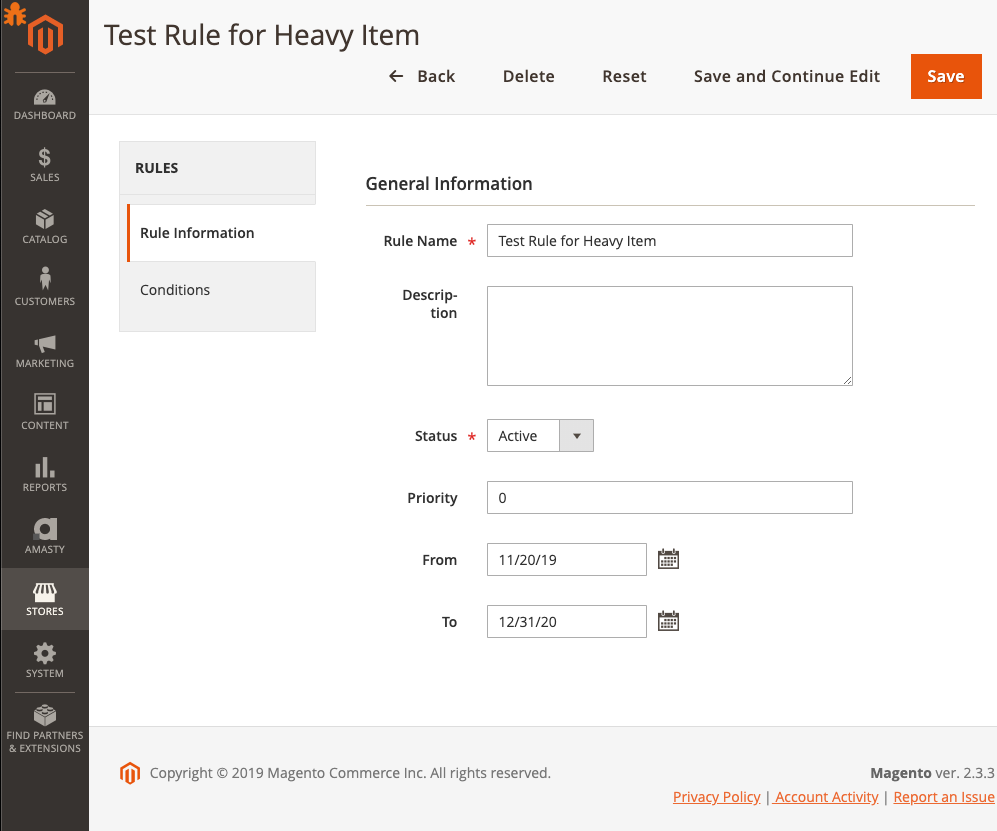
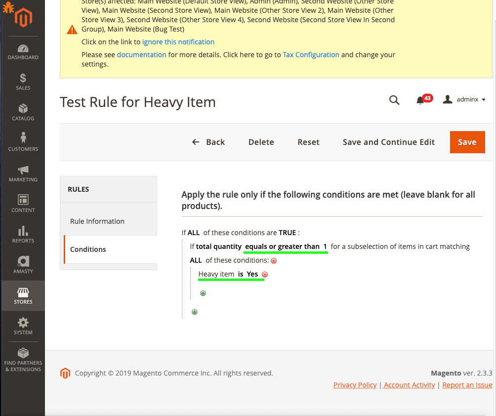
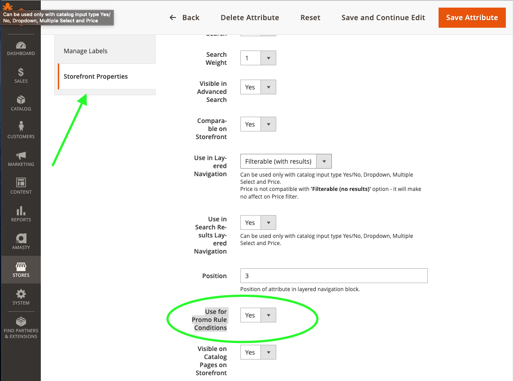
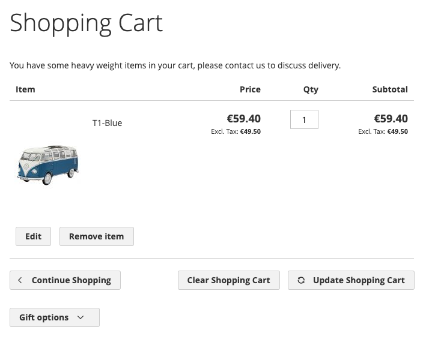
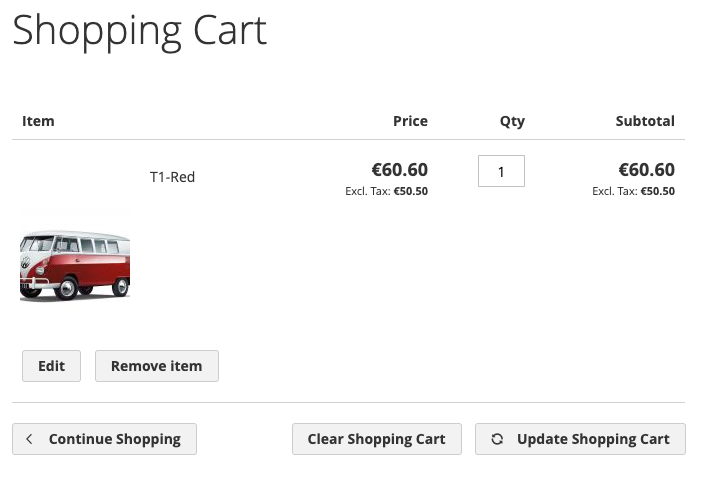

Итак, в прошлой статье мы рассмотрели код, позволяющий создать нам модель рулов с интерфейсом
в админке. Это значительная часть модуля, но сама по себе она бесполезна, если не научиться ее
использовать на фронтенде, а значит настало время разобраться с пользой рулов и заложенных в них
кондишенов.

В основе любой модели для валидации лежат условия (кондишены), по которым некоторый объект 
может быть првоерен на соотвествие, и, как следствие, мы можем на основании этой
проверки предпринять какието действия. В нашем примере мы создадим правило, определяющее 
находится ли в корзине товар с значением атрибута heavy_weight равным 1 (true), и, если такой
товар будет найден, будем выводить на странице корзины блок с сообщением, вроде 
"You have some heavy weight items in your cart, please contact us to discuss delivery.".
*Тут важно отметить, что такой способ, которым мы загружаем нашу модель рула, не может подходить 
полностью для боевых условий, т.к. мы четко пропишем рул с каким ID должен быть загружен
и по нему же будем производить валидацию известного нам объекта с товарами из корзины: 
шипинг адреса. В нормальном модуле (созданном не для примера) объекты рулов должны быть
загружены специальным классом, который проверит их на соответствие текущему окружению: 
стору, кастомеру и его группе, времени, дате и т.д. Этот аспект мы рассмотрим обязательно
в продолжении этой серии статей.*

Важное замечание: теперь код модуля доступен в открытом репозитории на github.com , так что вам больше не придется 
страдать, копируя куски кода один за одним с этих страниц. Вот ссылка на него: 
https://github.com/SiarheyUchukhlebau/Vendor_Rules

> Лена, это мой персональный репозиторий, так что думаю нам стоит транслировать его в наш
корпоративный. 

Для начала создадим нвоое правило в админке, которое будет искать в корзине проукдт с
указанным значением аттрибута heavy_weight:





*Если вы не видите ваш атрибут в списке атрибутов в кондишенах, то вам в первую очередь
следует проверить настройку этого атрибута, т.к. для него может быть выключена опция
Use For Promo Rule Conditions. Сделать это можно из админки в меню Stores > Attributes > Product > 
выбрать ваш атрибут из списка > Storefront Properties > Use for Promo Rule Conditions должно 
быть установлено в Yes, как на скриншоте:* 



Мое правило имеет ID 1 , далее в блоке я буду использовать его для упрощения процесса загрузки.
Теперь нам понадобится обновить лейаут страницы корзины, добавив туда наш новый блок с выводом
сообщения:

`app/code/Vendor/Rules/view/frontend/layout/checkout_cart_index.xml`

```xml
<?xml version="1.0"?>
<page xmlns:xsi="http://www.w3.org/2001/XMLSchema-instance" xsi:noNamespaceSchemaLocation="urn:magento:framework:View/Layout/etc/page_configuration.xsd">
    <body>
        <referenceContainer name="checkout.cart.form.before">
            <block class="Vendor\Rules\Block\Cart\RuleExample" name="custom_block_with_rules" template="Vendor_Rules::cart/example.phtml"/>
        </referenceContainer>
    </body>
</page>
```

Как вы могли заметить из лейаута, нам понадобится еще 2 файла: блок и темплейт. Давайте их создадим:

`app/code/Vendor/Rules/view/frontend/templates/cart/example.phtml`

```php
<?php
/** @var \Vendor\Rules\Block\Cart\RuleExample $block */
?>
<?= $block->getMessage();?>
```

В темплейте все просто, только вывод сообщения. При желании вы можете добавить необходимую для вас разметку.
Не забывайте только, что при использовании таких шаблонов на кешируемых фулл пейдж кешем
страницах результат будет закеширован. Для таких страниц следует использовать другой
подход, описанный хорошо в дев доках мадженты, вот ссылка https://devdocs.magento.com/guides/v2.3/extension-dev-guide/cache/page-caching/private-content.html .

Теперь добавим наш основной класс из этого примера, это класс блока:

`app/code/Vendor/Rules/Block/Cart/RuleExample.php`

```php
<?php

namespace Vendor\Rules\Block\Cart;

use Magento\Checkout\Model\Session as CheckoutSession;
use Magento\Framework\Exception\LocalizedException;
use Magento\Framework\View\Element\Template;
use Magento\Quote\Model\Quote\Address as QuoteAddress;
use Vendor\Rules\Model\Rule;
use Vendor\Rules\Model\ResourceModel\Rule\CollectionFactory as RulesCollectionFactory;

/**
 * Class RuleExample
 */
class RuleExample extends Template
{
    /**
     * @var RulesCollectionFactory
     */
    private $rulesCollectionFactory;

    /**
     * @var string
     */
    private $message;

    /**
     * @var CheckoutSession
     */
    private $checkoutSession;

    /**
     * RuleExample constructor.
     *
     * @param Template\Context $context
     * @param RulesCollectionFactory $rulesCollectionFactory
     * @param CheckoutSession $checkoutSession
     * @param array $data
     */
    public function __construct(
        Template\Context $context,
        RulesCollectionFactory $rulesCollectionFactory,
        CheckoutSession $checkoutSession,
        array $data = []
    ) {
        $this->rulesCollectionFactory = $rulesCollectionFactory;
        $this->checkoutSession        = $checkoutSession;
        $this->message                = '';
        parent::__construct($context, $data);
    }

    /**
     * @return string
     */
    public function getMessage(): string
    {
        if ($this->message) {
            return $this->message;
        }

        $shippingAddress = $this->getShippingAddress();
        if (!$shippingAddress) {
            return $this->message;
        }

        $rule = $this->getRule();
        if ($rule && $rule->validate($shippingAddress)) {
            $this->message = __(
                'You have some heavy weight items in your cart, please contact us to discuss delivery.'
            );
        }

        return $this->message;
    }

    /**
     * @return Rule|null
     */
    private function getRule(): ?Rule
    {
        /** @var \Vendor\Rules\Model\ResourceModel\Rule\Collection $rulesCollection */
        $rulesCollection = $this->rulesCollectionFactory->create();
        $rulesCollection->addFilter('rule_id', 1);
        /** @var Rule|null $rule */
        $rule = $rulesCollection->getFirstItem();

        return $rule;
    }

    /**
     * @return QuoteAddress|null
     */
    private function getShippingAddress(): ?QuoteAddress
    {
        /** @var \Magento\Quote\Model\Quote $quote */
        try {
            $quote = $this->checkoutSession->getQuote();
        } catch (LocalizedException $exception) {
            return null;
        }

        if (!$quote) {
            return null;
        }

        return $quote->getIsVirtual() ? $quote->getBillingAddress() : $quote->getShippingAddress();
    }
}
```

на этом классе мы остановимся подробнее, т.к. именно в нем скрыта вся валидация. У него всего
один публичный метод, который мы используем в нашем темплейте, это метод `getMessage()`. Внутри этого
метода определяется подходящий рул, который будет валидировать нашу корзину,
 определяется шипинг адрес, по которому будет проходить эта валидация. Шипинг адрес мы
 получаем вполне стандартным способом для фронтенда - запросив его из чекаут сессии.
 Рул мы просто загружаем из коллекции, используя фильтр по ID (как я указывал в начале статьи
 это не лучший способ и годится он только в качестве примера, постарайтесь описать метод
 получения рула таким образом, как вас устроит). Имея в нашем блоке 2 обязательных объекта
 нам остается только проверить что вернет метод `$rule->validate($shippingAddress)` нашего рула, 
 ложь или истину, и на основании этого результата сформировать (или нет) сообщение, 
 которое будет выводитсья на странцие корзины в нашем темплейте. Внутри модели рула это работает
 следующим образом:
 
```php
    /**
     * Validate rule conditions to determine if rule can run
     *
     * @param \Magento\Framework\DataObject $object
     * @return bool
     */
    public function validate(\Magento\Framework\DataObject $object)
    {
        return $this->getConditions()->validate($object);
    }
```

Этот метод уже существует в абстрактном классе `Magento\Rule\Model\AbstractModel` от которого
наследуется наш класс рулов `Vendor\Rules\Model\Rule`. Если нам необходима кастомная валидация,
можно добавить в класс рулов собственный метод `validate` с вызовом родительского метода, или без.

Вот что у нас получится в результате на фронтенде:

* продукт Т1 Blue имеет значение аттрибута heavy_weight равное 1 

  

* продукт T1 Red имеет значение аттрибута heavy_weight равное 0

  
  
Как видно на скриншотах, для синего Т1 под лейблом корзины выводится наше сообщение из блока.
Для красного же, напротив, сообщение не выводится. Это означает что наше правило работает.

Спасибо за прочтение. Буду рад ответить на ваши вопросы в комментариях.


